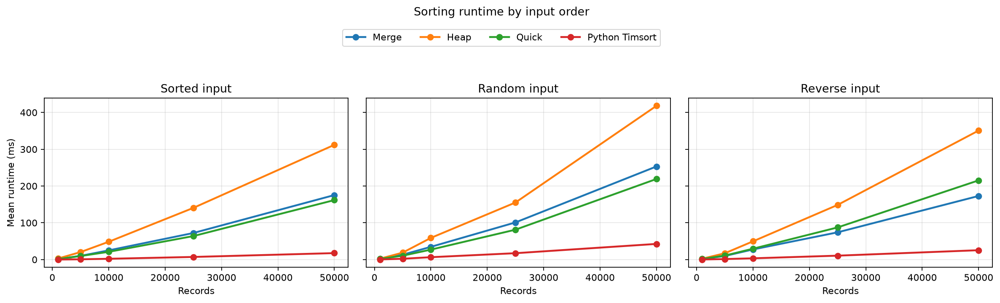
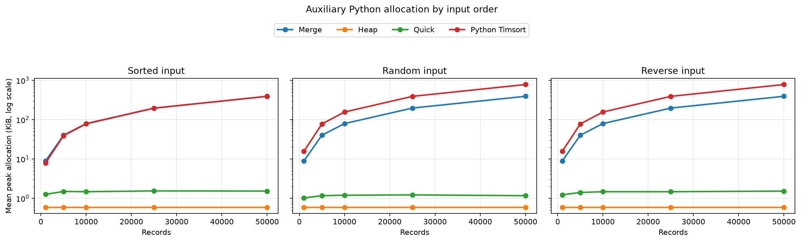

# Healthcare Sorting Benchmark

A reproducible comparison of hand-written Merge Sort, Heap Sort, and Quick Sort on
55,500 synthetic healthcare records, with Python's production-grade Timsort included as a
practical baseline.



## Why this project exists

Sorting is easy to describe asymptotically, but implementation details, input order, repeated
keys, and memory allocation all affect observed performance. This project measures those effects
on a realistic tabular workload while keeping every experiment reproducible.

This repository is a portfolio-grade refactor of university group coursework completed during
the first term of the 2024–2025 academic year. The public version is intentionally anonymous and
has been rewritten for correctness, repeatability, and maintainability.

The healthcare records are entirely synthetic. The project is educational and its results should
not be interpreted as guidance for clinical systems or patient-care decisions.

## Algorithms

| Algorithm | Best time | Average time | Worst time | Auxiliary space | Stable |
|---|---:|---:|---:|---:|:---:|
| Merge Sort | `O(n log n)` | `O(n log n)` | `O(n log n)` | `O(n)` | Yes |
| Heap Sort | `O(n log n)` | `O(n log n)` | `O(n log n)` | `O(1)` | No |
| Quick Sort | `O(n log n)` | `O(n log n)` | `O(n²)` | `O(log n)` stack | No |
| Python Timsort | `O(n)` | `O(n log n)` | `O(n log n)` | `O(n)` | Yes |

The custom Quick Sort uses median-of-three pivot selection, three-way partitioning for repeated
dates, and an explicit bounded stack. Its theoretical quadratic worst case still exists, but
already sorted records and duplicate-heavy records no longer cause Python recursion failures.

## Quick start

```bash
python -m venv .venv
# Windows PowerShell: .venv\Scripts\Activate.ps1
# macOS/Linux: source .venv/bin/activate
python -m pip install -e ".[dev]"
pytest
```

Sort a CSV file by admission date:

```bash
python -m healthcare_sorting sort \
  --algorithm quick \
  --input data/healthcare_dataset.csv \
  --output outputs/healthcare_sorted.csv \
  --key "Date of Admission"
```

Reproduce the committed benchmark:

```bash
python -m healthcare_sorting benchmark \
  --data data/healthcare_dataset.csv \
  --sizes 1000 5000 10000 25000 50000 \
  --runs 5 \
  --seed 412 \
  --output-dir results
```

The installed `healthcare-sorting` command accepts the same `sort` and `benchmark` subcommands.
Run either command with `--help` for all options.

## Benchmark methodology

- Each size is sampled from the same canonical dataset and sorted by `Date of Admission`.
- Every algorithm receives a fresh list containing the same record objects in the same order.
- `sorted`, `random`, and `reverse` describe input arrangement—not universal best, average, and
  worst cases, which depend on the algorithm.
- Random arrangements use deterministic per-trial seeds derived from the base seed `412`.
- Runtime uses `time.perf_counter_ns()` and excludes CSV loading, input copying, and validation.
- Peak Python allocation uses a separate `tracemalloc` pass so instrumentation does not distort
  the recorded runtime.
- Every result is checked for ascending order and exact preservation of the input records.

The committed snapshot contains 300 trials: four algorithms, three input arrangements, five
dataset sizes, and five runs. See [`results/summary.csv`](results/summary.csv) for aggregates,
[`results/raw_timings.csv`](results/raw_timings.csv) for individual trials, and
[`results/environment.json`](results/environment.json) for the machine and dataset fingerprint.



## Findings

At 50,000 records, the mean runtime across five trials was:

| Algorithm | Sorted | Random | Reverse |
|---|---:|---:|---:|
| Merge Sort | 175.38 ms | 253.21 ms | **172.97 ms** |
| Heap Sort | 311.98 ms | 418.15 ms | 350.83 ms |
| Quick Sort | **161.72 ms** | **219.18 ms** | 215.36 ms |
| Python Timsort | 17.54 ms | 42.56 ms | 25.44 ms |

Bold values identify the fastest hand-written algorithm for each input arrangement. These exact
measurements are machine-dependent, but the snapshot shows several useful patterns:

- Python's built-in Timsort is the practical baseline and benefits strongly from existing order.
- Quick Sort was the fastest custom implementation for sorted and random input, while Merge Sort
  led on reverse input.
- Merge Sort was comparatively consistent but allocated about 392 KiB at 50,000 records.
- Heap and Quick Sort allocated less than 2 KiB in the traced sorting step; Heap Sort paid for that
  small memory footprint with the longest runtime in every arrangement.
- Three-way partitioning handled repeated admission dates without deep recursion or quadratic
  behavior on the tested ordered inputs.

## Project structure

```text
src/healthcare_sorting/   Algorithms, data validation, benchmark engine, and CLI
tests/                    Unit and end-to-end tests
data/                     Canonical CC0 synthetic dataset and attribution
results/                  Reproducible CSV results, charts, and environment metadata
.github/workflows/        Python 3.10 and 3.12 continuous integration
```

## Dataset and limitations

The [Healthcare Dataset](https://www.kaggle.com/datasets/prasad22/healthcare-dataset) was created
with Faker and released under CC0. One 8.4 MB copy is committed for reproducibility. See
[`data/README.md`](data/README.md) for its schema, checksum, and licensing details.

These measurements describe pure-Python implementations on one synthetic dataset and one machine.
They do not replace profiling in a production workload. `tracemalloc` reports Python-managed
allocations rather than total process memory, and operating-system scheduling can introduce timing
noise even across repeated runs.

## License

The refactored source code is available under the [MIT License](LICENSE). The dataset is separately
available under [CC0 1.0 Universal](https://creativecommons.org/publicdomain/zero/1.0/).
